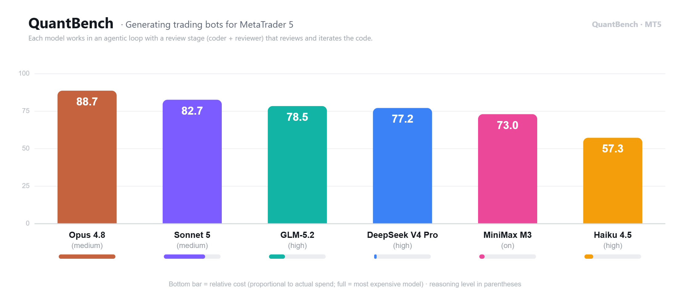
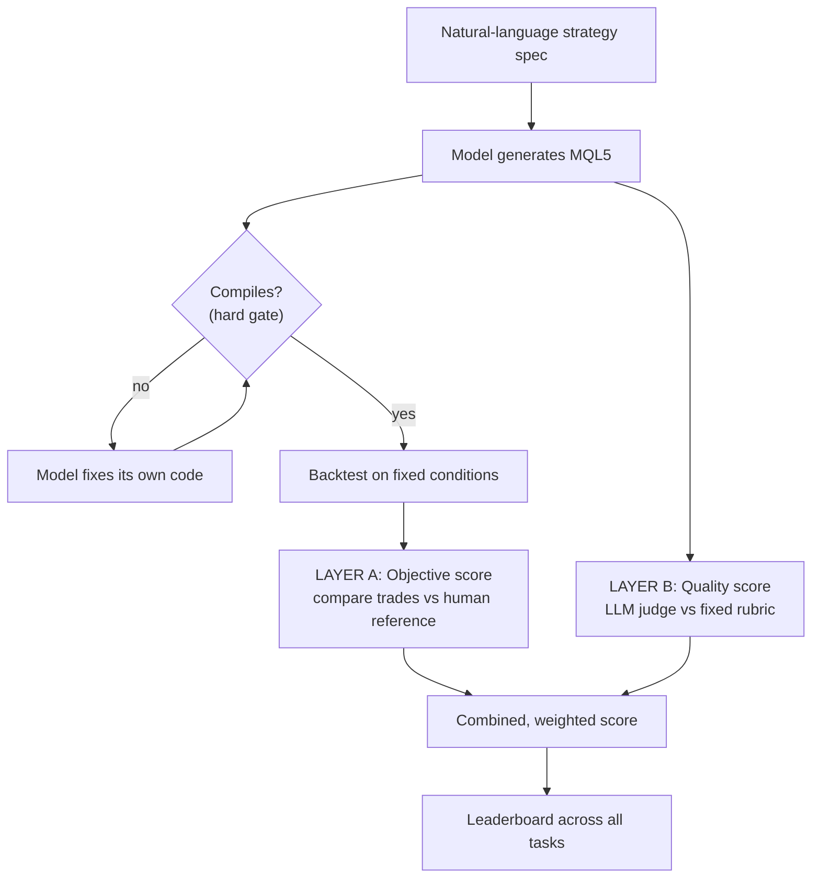

# QuantBench

A benchmark that measures how well different LLMs **generate and modify MQL5 Expert Advisors** (MetaTrader 5 trading bots) from a plain-language spec. Each model's code is **compiled and backtested on real market data**, then scored on both how it behaves and how well it is written.

> This is a write-up of a benchmark I designed and built. To protect the methodology, this repo describes the approach **conceptually only**. It contains no harness code, no scoring internals, no task dataset, and no prompts.

## Why I built it

I built QuantBench as the **model-selection engine** behind an AI product whose core feature is turning a trader's natural-language strategy into a working MT5 bot. I needed an objective way to answer one question: **which LLM should be the engine?**

Generic coding benchmarks do not capture this. Here, "good" means the generated Expert Advisor has to **compile**, **run in a real backtester**, and **behave like a correct, human-built reference**, not just look plausible. And I found early that "which code looks better" judgments, on their own, were unstable and unreliable. So I built a domain-specific, executable yardstick.

## How it works: two layers

QuantBench mirrors how serious code benchmarks are built: an **objective execution layer** plus an **LLM-as-judge quality layer**, scored separately because a bot can reproduce trades perfectly with mediocre code, or vice versa.

**Layer A, objective scoring (no AI involved).** The generated EA runs through a real pipeline: it must **compile** (a hard gate; fail to build and it is out), the model gets a loop to fix its own logic and recompile, then the bot is **backtested on fixed conditions**. The backtest produces a list of executed trades, and QuantBench compares those against the **human reference bot's** trades for the same task: did it take the same number of trades, and the same trades at the same moments. There are explicit penalty tiers for "did not compile," "failed to generate," and "traded zero when it should have traded," plus a health gate so a crashed or incomplete backtest cannot score well.

**Layer B, quality scoring (LLM-as-judge).** A separate judge model scores the **code quality** of each bot against a **fixed rubric** across several weighted dimensions (correctness, robustness, MQL5 usage, maintainability, debuggability, efficiency), with each item backed by cited evidence. For robustness, the judge runs several times and a per-item majority is taken. For modification tasks, the judge scores only the **diff**, not inherited code.

The benchmark spans tasks across difficulty tiers (easy / medium / complex) and two task types (create from scratch / modify existing code).

## The key lesson: compare against a fixed reference, not against each other

This is the most important thing QuantBench taught me, and it is the opposite of where I started.

- The **objective layer pairs every bot against a fixed human reference** for its task. That pairing is exactly what makes it objective and reproducible: the yardstick never moves.
- For the **quality judge**, I first built a **comparative** judge that ranked the bots against each other. I **threw it out.** It was unstable: it bunched all the bots into a narrow band, and worse, each bot's score **depended on which other models happened to be in the batch**. Add or remove a model and everyone's scores shifted, so results were not reproducible.
- Replacing it with an **absolute, fixed-rubric judge** (score one bot against a fixed standard, never against the others) made the quality scores **stable, reproducible, and invariant** to which models were present.

So the rule I landed on: **compare to a fixed reference (good), never compare models head-to-head for a subjective score (unstable).**

## What it produces

A **leaderboard** across all tasks, with every model scored on two axes (objective trade-reproduction and rubric code-quality) plus a combined, re-weightable final score. Every number is auditable back to its parts: compiled yes/no, trades vs reference, trade alignment, input parity for modifications, backtest health, and per-dimension quality scores.

Where the benchmark really discriminates is the **hardest tasks**. On easy or ambiguous specs, models converge near the reference and the small differences are usually valid interpretations of an ambiguous prompt, not bugs. On the complex tasks, they diverge sharply, and that is where the ranking becomes meaningful.

## Other lessons worth keeping

- **Two axes are independent.** Behavior replication and code quality do not track each other, so they are scored and weighted separately.
- **Convergence is not error.** When every model lands near each other but slightly off the reference, that is usually a valid reading of an ambiguous spec. The objective score uses trade *alignment*, so it barely penalizes this.
- **Spec quality is a confound.** An ambiguous prompt can make every model fail identically, which is a benchmark problem, not a model signal. Prompts were audited and only minimally corrected when the reference proved a clear error.
- **Measurement artifacts vs real bugs.** A dedicated audit separates a harness artifact (fixable) from a real bot bug (a legitimate result). A big source of artifacts: models name their inputs differently from the reference, so reference test inputs did not apply, which needed a tolerant input matcher.
- **Each model needs its own runtime treatment.** Reasoning control, caching, streaming, and timeout handling differ across models and have to be tuned per model whenever one is added.
- **Anti-leakage is essential.** Any task used in the benchmark must have its human reference kept out of what the model can see, or it would just copy the answer.

## What this project shows

- LLM **evaluation and benchmark design**: dual-layer scoring, rubric design, and judge-stability techniques (majority-of-N, absolute vs comparative)
- Domain expertise in **MQL5 / MetaTrader 5**, trading strategies, and backtesting validity
- Building **reproducible, resumable evaluation harnesses**: hard gates, retry-on-zero, crash recovery, serialized resource handling
- **Multi-model engineering**: per-model routing, prompt-caching strategy, reasoning-budget quirks, cost tracking
- **Experiment rigor**: anti-leakage splits, fidelity auditing, spec-quality review, re-baselining when the environment changes
